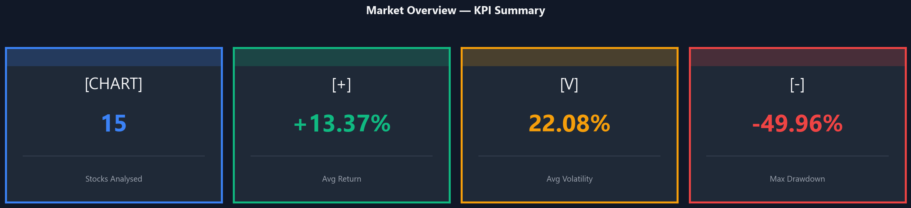
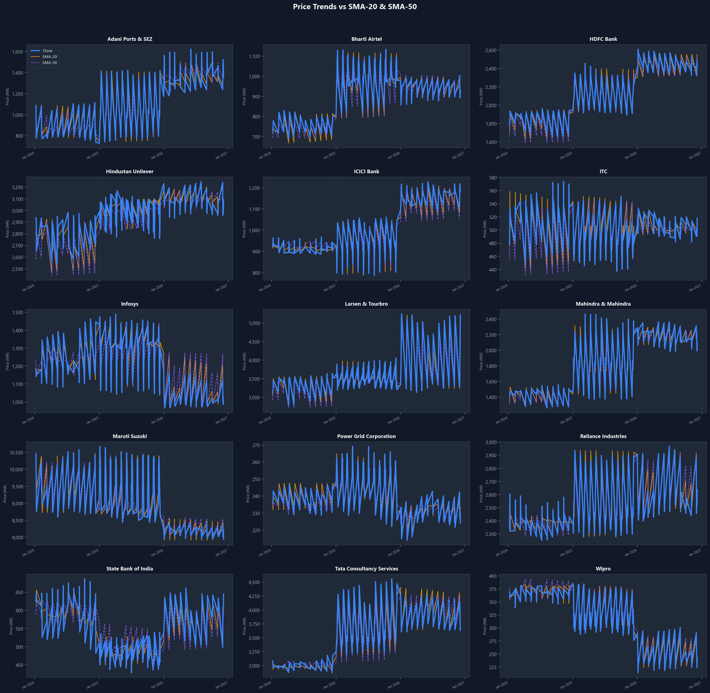
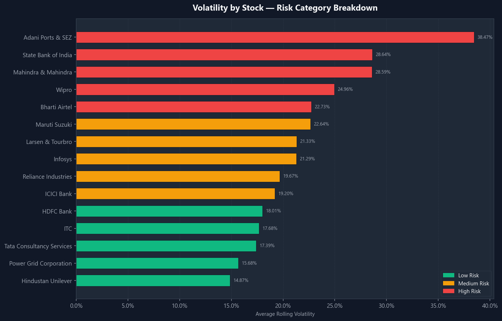
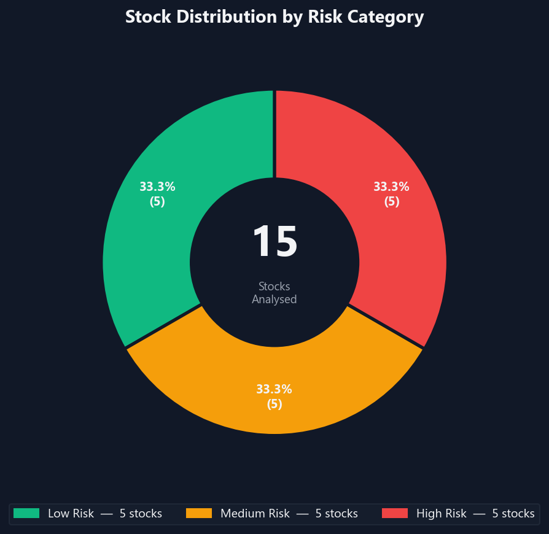
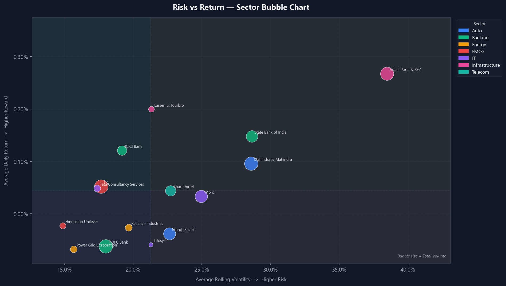
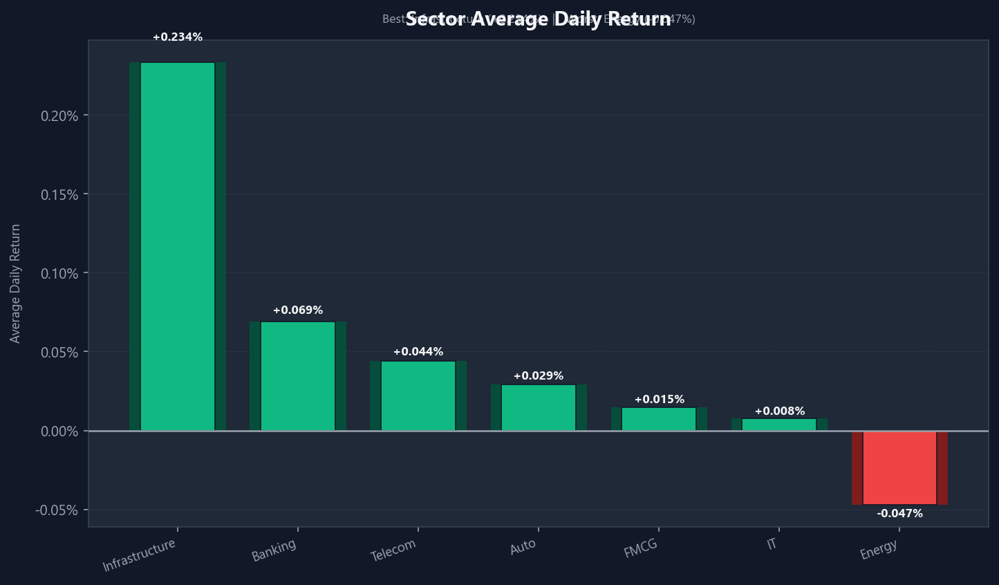
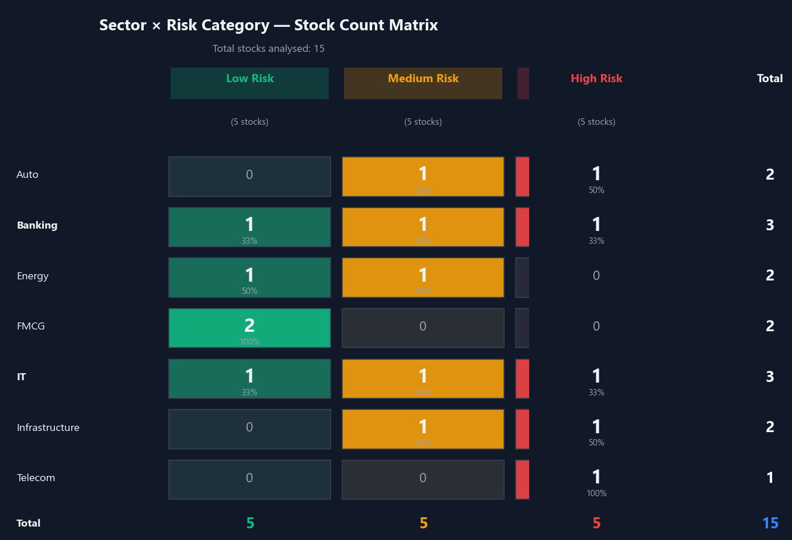

# Stock Market Risk & Analytics Dashboard

A data pipeline and Power BI dashboard analyzing 2 years of daily price data across 15 major NSE-listed stocks spanning 7 sectors, focusing on volatility-based risk scoring. Built to practice the full analytics/BI workflow (data pipeline → cleaned dataset → dashboard → DAX-driven insights) end to end.

---

## What It Does

1. **Extracts:** Pulls historical OHLCV data for 15 major NSE stocks spanning 7 key sectors (IT, Banking, FMCG, Energy, Telecom, Auto, Infrastructure) via the Yahoo Finance API.
2. **Transforms & Computes:** Calculates daily returns, moving averages (20D/50D SMAs), 20-day annualized rolling volatility, drawdown from peaks, and static Low/Medium/High risk classifications.
3. **Visualizes:** Imports the clean dataset into a 3-page Power BI report comprising:
   - **Market Overview:** Core KPIs, trend lines, and price performance vs. moving averages.
   - **Risk Analysis:** Drawdown trends, a Volatility vs. Return scatter plot, and a detailed risk matrix.
   - **Sector Comparison:** Cross-sector aggregate performance and risk concentration.
4. **Analyzes:** Drives deep insights using 13 custom DAX measures for dynamic calculations.

---

## Project Structure

```
stockmarket/
├── scripts/
│   ├── fetch_data.py           # Pulls raw daily OHLCV data from Yahoo Finance
│   ├── transform_data.py       # Computes daily returns, SMAs, volatility, drawdown, and risk categories
│   └── generate_sample_data.py # Synthetic-data fallback for offline testing
├── data/
│   └── stock_data_clean.csv    # Cleaned, enriched dataset imported into Power BI
├── docs/
│   ├── PIPELINE.md             # Data flow architecture and mathematical transformation logic
│   ├── DAX_MEASURES.md         # Full formulas for all 13 DAX measures
│   └── DASHBOARD_GUIDE.md      # Step-by-step layout and build guide for Power BI
├── dashboard/
│   ├── generate_charts.py      # Standalone script — exports all 7 charts as PNGs
│   ├── README.md               # Dashboard overview with embedded chart screenshots
│   └── screenshots/            # Auto-generated PNG exports of all 7 charts
└── requirements.txt            # Python dependencies
```

---

## Technical Stack

* **Data Source:** Yahoo Finance API (via `yfinance` library)
* **Pipeline Engine:** Python 3.x, pandas, numpy
* **Storage:** CSV (flat-file, database-ready schema)
* **Analytics & BI:** Power BI Desktop, DAX (Data Analysis Expressions)

---

## How to Setup & Run

### 1. Set Up Python Environment
Create a virtual environment and install the required dependencies:
```bash
# Create virtual environment
python -m venv .venv

# Activate virtual environment (Windows)
.venv\Scripts\activate

# Install dependencies
pip install -r requirements.txt
```

### 2. Run the Data Pipeline

To fetch real historical price data from Yahoo Finance:
```bash
python scripts/fetch_data.py
```
*Note: This script will download 2 years + 75 days of daily prices to establish a rolling SMA/volatility warm-up window.*

Alternatively, if you are offline or want to run a quick test with synthetic data:
```bash
python scripts/generate_sample_data.py
```

### 3. Transform and Enrich the Dataset
Run the transformation pipeline to calculate the risk metrics and clean the dataset:
```bash
python scripts/transform_data.py
```
This output is saved to `data/stock_data_clean.csv`, ready for visualization.

### 4. Build the Power BI Dashboard
Open **Power BI Desktop** and follow the step-by-step assembly instructions in [DASHBOARD_GUIDE.md](docs/DASHBOARD_GUIDE.md) to build the visual reports and integrate the DAX measures detailed in [DAX_MEASURES.md](docs/DAX_MEASURES.md).

### 5. Export Charts as Images
To generate all 7 dashboard charts as PNG files (no Power BI required):
```bash
python dashboard/generate_charts.py
```
Charts are saved to `dashboard/screenshots/`.

---

## Key Metrics Computed

* **Daily Returns ($R_t$):** Standard daily percentage price changes.
* **Simple Moving Averages (20D/50D SMAs):** Trend indicator tracking short and medium term price momentum.
* **Rolling Annualized Volatility (20-day):** Annualized standard deviation of daily returns, representing the stock's primary risk score.
* **Drawdown from Peak:** Percentage loss from the highest peak price reached by the stock during the period.
* **Risk Category (Low/Medium/High):** Volatility tercile classification dividing the 15 stocks into three risk groups of 5 stocks each.
* **Sharpe Ratio (Approximate):** Measures risk-adjusted excess returns assuming a 6% Indian market risk-free rate ($R_f$).

---

## Dashboard Screenshots

### Chart 1 — KPI Summary Cards


### Chart 2 — Price Trends vs SMA-20 & SMA-50


### Chart 3 — Volatility by Stock (Risk Colour-Coded)


### Chart 4 — Risk Category Distribution


### Chart 5 — Risk vs Return Bubble Chart


### Chart 6 — Sector Average Daily Return


### Chart 7 — Sector x Risk Category Matrix

